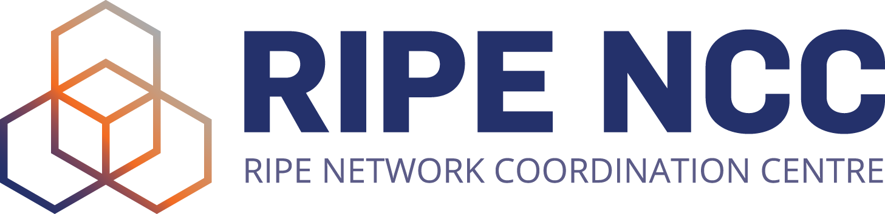

# REVERSE DNS CHECKER RIPE

This is a script linked in [this RIPE Labs article](https://labs.ripe.net)

To execute it, you will need to download [this file](https://ftp.ripe.net/ripe/dbase/split/ripe.db.domain.gz) which is a
daily dump of all the RIPE-NCC domain objects and decompress it at the root of the project.

You will also need to install [zonemaster-cli](https://github.com/zonemaster/zonemaster/blob/master/docs/public/installation/zonemaster-cli.md)

